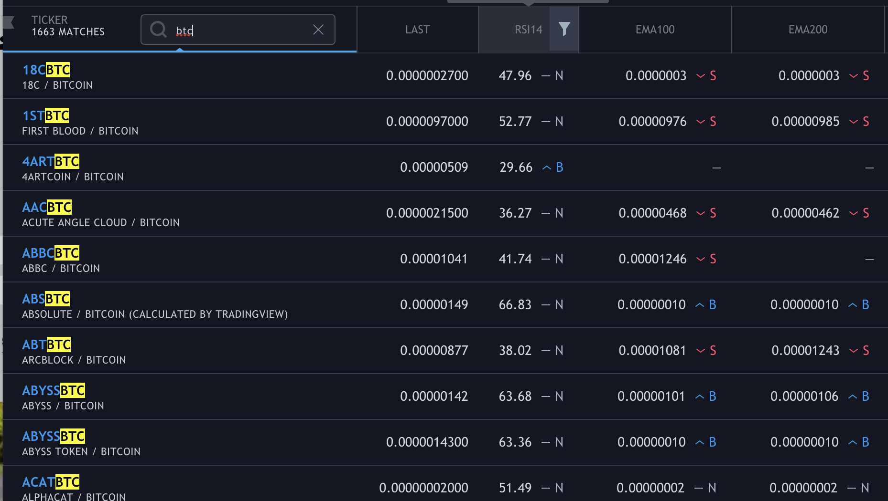

# assetScreener
 The **assetScreener App** scans and filters the Financial Asset Market to help find the best trading opportunities, based on:   
(PRICE($)),  
(RSI 14),  
(EMA 100),  
(EMA 200),  

## App Description
#### An app that helps me identify cryptocurrencies that will increase in price.  
- there are over 6000 different cryptocurrencies in the crypto-currency market. 
- A lot of them will gain value within the coming days, months, years.   
and a lot of them will not.  
This app helps me to identify those cryptocurrencies which are of interest to me and my trading account.

**C** - create new entries to watchlist / search bar to filter assets.  
**R** - read abd display csv file of data  on assets.  
**U** - update watch list, update filters on column headers, update search bar.   
**D** - delete watchlist choices, clear all, delete filters on columns, leaving default.  

## Sketch of Mobile Layout vs Desktop Layout

## Preview of columns and data. (A semi-completed view of what the app could look like)

 # Tools used to accomplish app

AJAX 